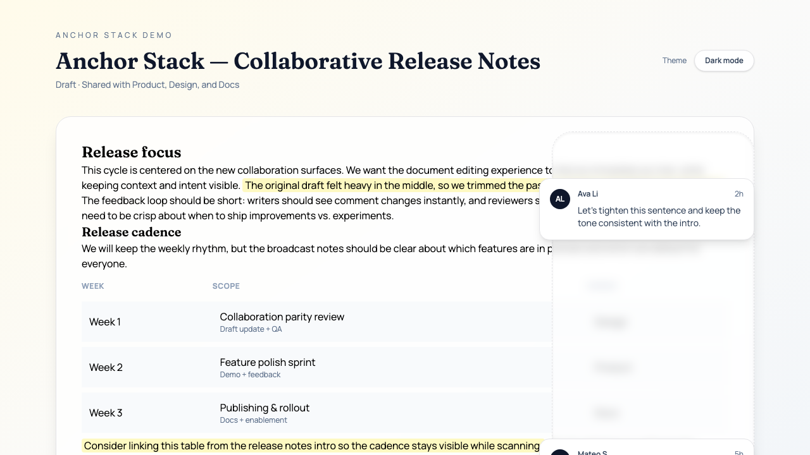

# Anchor Stack

Headless React utilities for positioning stacked UI elements next to their anchor points — perfect for inline comments, review threads, and annotations.



## Features

- Anchor-aware stacking with collision detection
- Selected items stay on their anchors while neighbors reflow
- Pure positioning function for unit testing
- Demo page with text selection + comment creation

## Installation

```bash
bun add anchor-stack
```

## Quick start

```tsx
import { useAnchorStack } from 'anchor-stack'
import type { AnchorStackItem } from 'anchor-stack'

const items: AnchorStackItem<{ text: string }>[] = [
  { id: 'comment-1', data: { text: 'Hello' } },
  { id: 'comment-2', data: { text: 'World' } },
]

function Comments() {
  const { positions, refs, sortedItems } = useAnchorStack({
    items,
    selectedId: null,
    gap: 12,
    anchorResolver: (item) => document.querySelector(`[data-anchor="${item.id}"]`),
  })

  return (
    <aside>
      {sortedItems.map((item) => (
        <div
          key={item.id}
          ref={refs.get(item.id)}
          style={{ top: positions.get(item.id)?.top ?? 0, position: 'absolute' }}
        >
          {item.data.text}
        </div>
      ))}
    </aside>
  )
}
```

## API

- `useAnchorStack(options)` → `{ positions, refs, sortedItems }`
- `calculatePositions({ items, anchorTops, heights, selectedId, gap })`
- `AnchorStackProvider` and `useAnchorStackContext` for context-based usage
- `useRefs()` for dynamic, stable ref generation

## Demo

Live demo: https://<your-github-username>.github.io/anchor-stack/

To build the demo locally:

```bash
bun run build:demo
```

Then open `demo/index.html`.
